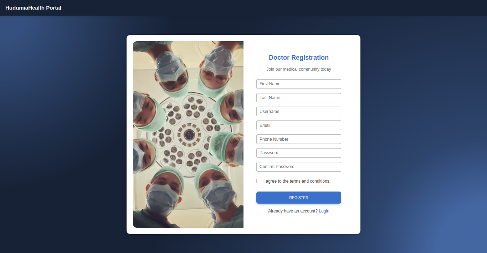
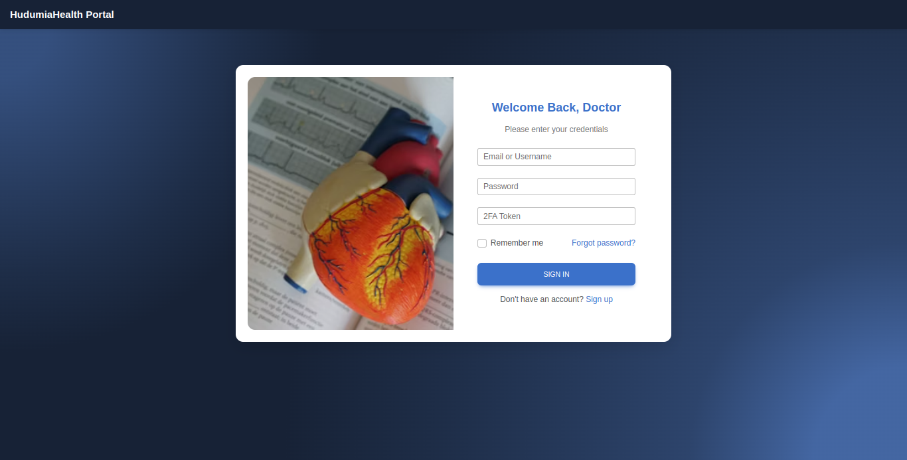
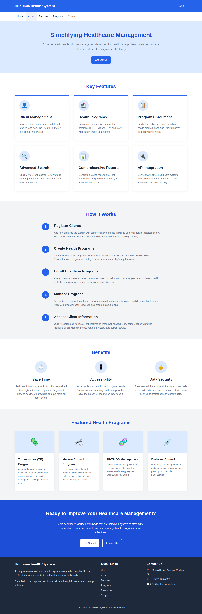

# Hudumia Health App

Hudumia Health is a **fullstack health management platform** that enables doctors to manage health programs, enroll clients into those programs, and track their progress efficiently.

Built with:
- **Backend:** Node.js, Express, PostgreSQL
- **Frontend:** React.js
- **Other Libraries:** Material UI, MDBReact, JWT Authentication, Bcrypt, dotenv

---

## Project Structure

```
HUDUMIA_HEALTH/
├── huduma-backend/
│   ├── middleware/
│   │   └── authMiddleware.js
│   ├── utils/
│   │   ├── 2fa.js
│   │   ├── auth.js
│   │   ├── emailConfig.js
│   ├── .env
│   ├── hudumiadb.js
│   ├── package.json
│   ├── schema.sql
│   └── serverside.js
├── public/
│   └── index.html
├── src/
│   ├── components/
│   │   ├── auth/
│   │   │   ├── DoctorLogin.js
│   │   │   └── DoctorSignUp.js
│   │   └── dashboard/
│   │       └── Dashboard.js
│   ├── services/
│   │   └── Api.js
│   ├── App.js
│   ├── index.js
│   ├── Routes.js
├── package.json
└── README.md
```

---

## Features

### Authentication
- **Doctor Signup** and **Login** with JWT Authentication.
- Passwords are hashed securely using **bcrypt**.
- **2FA (Two Factor Authentication)** support prepared for future extension.
- JWT tokens stored securely in local storage.

### Doctor Dashboard
- View and manage health programs.
- View and manage enrolled clients.
- Search for clients.

### Programs Management
- Create new health programs (e.g., Malaria, HIV, TB Programs).
- Edit, view and delete health programs.

### Client Management
- Register new clients.
- Enroll clients into one or more health programs.
- Edit and delete client profiles.

---

## How to Run

### 1. Backend Setup

```bash
cd huduma-backend
npm install
# Create a .env file with:
# JWT_SECRET=your_secret_key
# DB connection details
npm start
```

- Backend runs on **http://localhost:3004**.

---

### 2. Frontend Setup

```bash
cd ..
npm install
npm start
```

- Frontend runs on **http://localhost:3000**.

---

## Environment Variables (.env)

**Backend .env example:**

```
PORT=3004
JWT_SECRET=your_super_secret_key
DB_USER=your_db_user
DB_PASSWORD=your_db_password
DB_HOST=localhost
DB_PORT=5432
DB_DATABASE=hudumia_health_db
```

---

## API Endpoints

| Method | Route                  | Description                   |
|--------|-------------------------|-------------------------------|
| POST   | /api/doctors/signup      | Register a doctor             |
| POST   | /api/doctors/login       | Doctor login                  |
| GET    | /api/programs            | Get all health programs       |
| POST   | /api/programs            | Create a new program          |
| GET    | /api/clients             | Get all clients               |
| POST   | /api/clients             | Register a new client         |
| POST   | /api/enrollments         | Enroll a client in programs   |

*(All protected routes require Bearer Token authentication)*

---

## Future Improvements
- Add patient follow-up tracking.
- Implement 2FA (fully).
- Admin panel and doctor profile customization.
- Email notifications using nodemailer.

---

## Screenshots 
sign up 



---

log in 



---

Landing page



---

## Presentations
pdf format

[Hudumia health presentation 1](https://drive.google.com/file/d/1FllWCgy-LcI-3JclSCfnj8G7DkgOac2S/view?usp=drive_link)


---

ppt format

[Hudumia Health presentation 2](https://docs.google.com/presentation/d/1JTPBRn231fQgzQI42mr75SlP0aqtd0io/edit?usp=drive_link&ouid=118002078082822015260&rtpof=true&sd=true)

---
[Hudumia Health Live demo 1](public/presentations/hudumia-health%20live%20demos/demo1.mp4)

---

[Hudumia Health Live demo 2](public/presentations/hudumia-health%20live%20demos/demo2edited.mp4)


---

## License
This project is licensed under the **MIT License**.

---